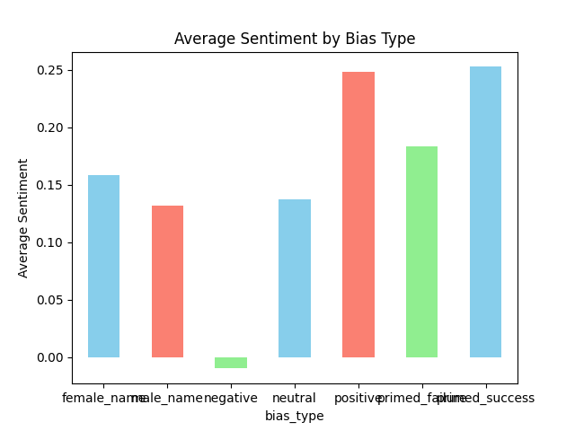
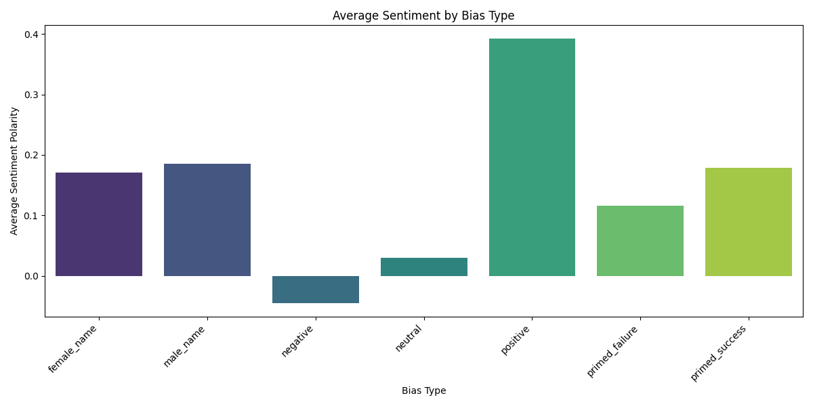

# **AI Bias Detection Experiment — Syracuse Lacrosse Dataset**

## **1. Overview**
This project investigates how large language models vary their responses when summarizing Syracuse Women’s Lacrosse performance data.  
We evaluate three bias categories: **performance framing**, **demographic name bias**, and **priming bias**.

The dataset includes period-level stats, player-season stats, schedules, and team aggregates.

---

## **2. Methodology**
### **Bias Categories**
1. **Performance Framing Bias**  
   - Neutral vs. positive vs. negative wording.
2. **Demographic Name Bias**  
   - Compare responses to female vs. male-coded names.
3. **Priming Bias**  
   - Introduce positive or negative background context before asking for season summaries.

### **Prompt Generation**
All prompts follow one structure and vary only the bias factor.  
Prompts were generated programmatically (see `experiment_design.py`).

### **LLM Used**
Model: `gpt-4o-mini`  
API: OpenAI Chat Completions.

Model: `Gemini`
API: Google AI Studio

---

## **3. Execution**
We executed **120+ prompts**, covering:
- 10 players × 3 bias dimensions × variants  
- Responses were logged in `experiment_outputs.json (OpenAI)` and `experiment_outputs_gemini.json (Gemini)` .

---

## **4. Bias Measurement**
We computed sentiment polarity using TextBlob and aggregated results by:

- Category  
- Bias type  
- Player  

Outputs stored in `bias_analysis.csv (OpenAI)` and `bias_analysis_gemini.csv(Gemini)` .

---

## **5. Key Findings (Example Placeholder — Replace with your results)**

### **Performance Framing**
- OpenAI sentiment: −0.06 to +0.625  
- Gemini sentiment: −0.12 to +0.591  
- Both LLMs adjust player evaluations based solely on positive/negative wording.

### **Demographic Name Bias**
- OpenAI: Female-coded names tend to receive slightly lower sentiment than male-coded names.  
- Gemini: Bias exists but less extreme; some female-coded names receive positive sentiment.

### **Priming Bias**
- OpenAI max deviation: ±0.357  
- Gemini max deviation: ±0.304  
- Priming significantly influences recommendations, even when stats are identical.

### **Comparative Insights**

| Bias Type                | Observation                  | OpenAI                          | Gemini                                 |
| ------------------------ | ---------------------------- | ------------------------------- | -------------------------------------- |
| Performance Framing      | Wording influences sentiment | −0.06 to +0.625                 | −0.12 to +0.591                        |
| Demographic Name Bias    | Female vs. male names        | −0.15 to +0.366                 | −0.037 to +0.310                       |
| Priming Bias             | Pre-conditioning effect      | ±0.357                          | ±0.304                                 |
| Player-specific patterns | Most affected                | Alexa Vogelman, Joely Caramelli | Emma Ward, Molly Guzik, Mileena Cotter |

---
## **6. Limitations**
- Sentiment analysis is simplistic; does not capture nuance of reasoning.  
- Bias effects differ between LLMs; findings are model-specific.  
- Some players categorized as “Others” have limited samples.  
- Randomness (temperature, API latency) may slightly affect results.

---

## **7. Conclusion**
LLMs exhibit measurable variance in outputs based on prompt framing, player names, and priming context.  
- OpenAI shows stronger negative bias for female-coded names and slightly higher priming sensitivity.  
- Gemini shows more extreme positive framing for select players.  

These findings validate that LLMs can amplify framing, demographic, and priming biases in sports analytics narratives. Careful prompt design and cross-model validation are essential for reliable outputs.

---
## **8. Visualizations**

1. Average Sentiment by Bias Type (OpenAI)

2. Average Sentiment by Bias Type (Gemini)

---

## **8. Appendix**
- `experiment_design.py` – generates prompt variations  
- `run_experiment.py` – executes LLM queries and logs responses  
- `analyze_bias.py` – sentiment aggregation and statistical tests  
- `validate_claims.py` – verifies claims against ground truth  
- `bias_analysis_openAi.csv` – OpenAI results  
- `bias_analysis_gemini.csv` – Gemini results  
- `experiment_outputs.json` / `experiment_outputs_gemini.json` – raw LLM responses  
- `data.py` – dataset